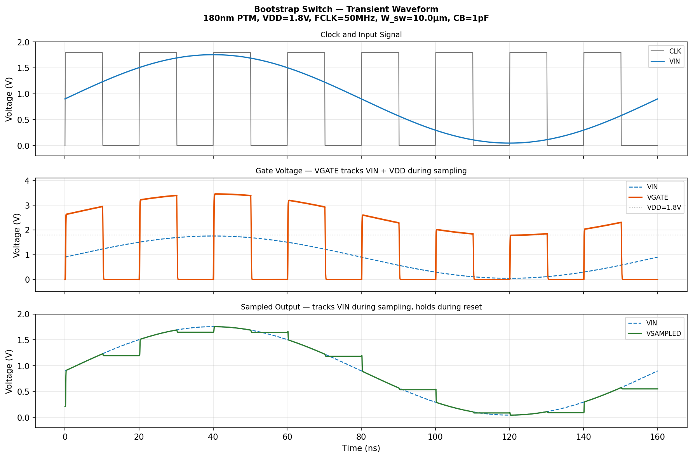
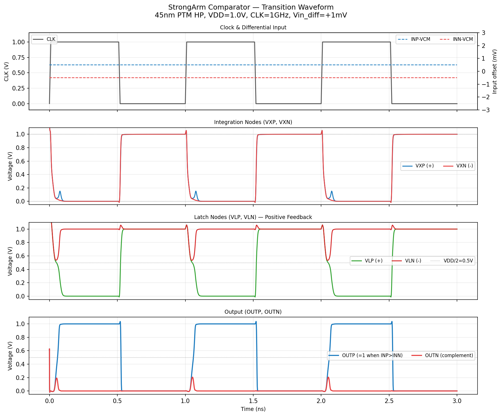

# analog-circuit-skills


一个面向 AI Agent 的模拟电路仿真技能合集，基于 **ngspice + Python**。
每个技能涵盖理论验证、电路搭建、仿真和晶体管尺寸设计。

## 技能总览

| 技能 | 工艺节点 | VDD | 主题 |
|------|---------|-----|------|
| [comparator](comparator/) | 45nm PTM HP | 1.0 V | StrongArm 动态比较器 |
| [bootstrap_switch](bootstrap_switch/) | 180 / 45 / 22nm PTM | 1.8 / 1.0 / 0.8 V | 自举采样开关 |
| LDO | — | — | 低压差线性稳压器 *(开发中)* |

## 自举开关

用于高线性度 ADC 前端的自举 NMOS 采样开关。
自举机制使 Vgs 始终等于 VDD，与输入信号无关，从而实现恒定的导通电阻——这是 8 比特以上精度采样的关键。

**波形图** — 采样阶段 VGATE 始终跟踪 VIN + VDD：



关键特性：
- **自举机制**：使用 1pF 引导电容（CB）将采样晶体管的栅极电压提升至 VIN + VDD
- **恒定导通电阻**：Vgs = VDD 保持常数，不受输入信号影响
- **多工艺支持**：在 180nm / 45nm / 22nm 工艺节点上验证

## StrongArm 比较器

高速 SAR ADC 中的动态再生比较器。
仿真展示积分阶段（VXP/VXN）、锁存再生（VLP/VLN）和数字输出的完整时序。



## 运行方式

```bash
# 自举开关（所有仿真）
cd bootstrap_switch/assets
python run_tran_bts.py

# StrongArm 比较器
cd comparator/assets
python run_tran_strongarm_comp.py
```

所有输出（日志、图像）保存到技能专用目录：`.work_bootstrap/` 或 `.work_comparator/`。

## 环境依赖

- [ngspice](https://ngspice.sourceforge.io/) — 电路仿真器（需在 PATH 中）
- Python 3 + `numpy`、`matplotlib`、`scipy`
- 已安装技能：`.claude/skills/` 下的 `ngspice`、`gmoverid`、`transistor-models`

## 文件结构

```
analog-circuit-skills/
├── comparator/              # StrongArm 比较器技能
│   ├── SKILL.md            # 详细文档
│   └── assets/             # 网表模板 + Python 脚本
├── bootstrap_switch/        # 自举采样开关技能
│   ├── SKILL.md            # 详细文档
│   └── assets/             # 网表模板 + Python 脚本
├── .work_comparator/       # 比较器临时输出目录
├── .work_bootstrap/        # 自举开关临时输出目录
└── README.md               # 本文件
```

## 技能详情

完整的理论、电路设计、仿真方法说明请参见各技能目录下的 `SKILL.md`。
