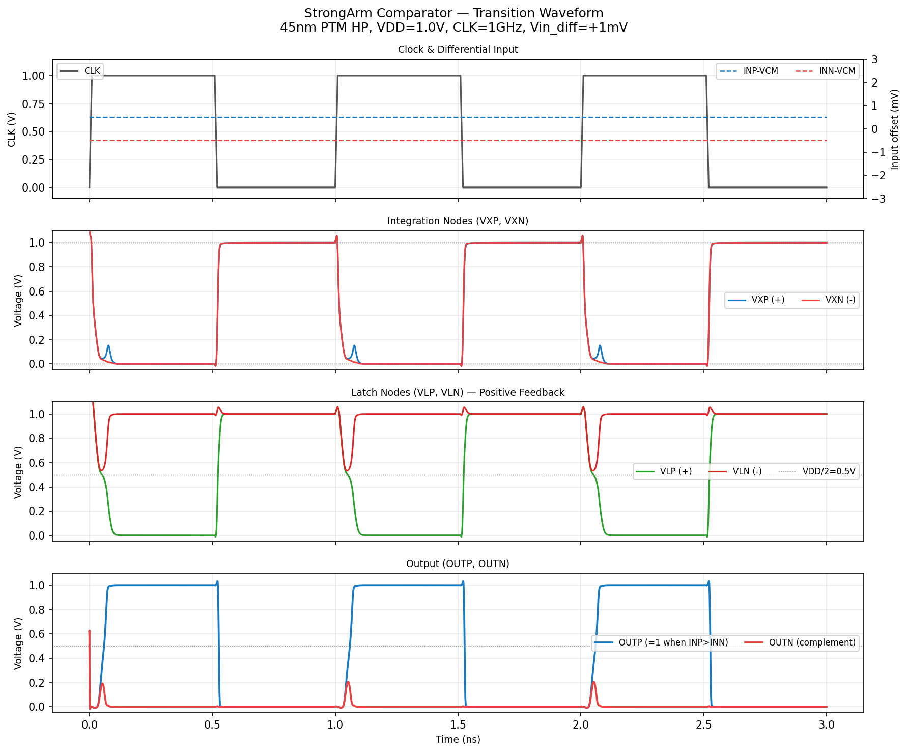

# analog-circuit-skills


这是一个面向 AI 智能体的模拟电路仿真技能合集，基于 **ngspice + Python**。

每个模块尽量覆盖从电路拓扑、理论验证、网表搭建、仿真运行到指标提取的完整流程，方便智能体或工程师快速复现实验、修改参数并观察电路行为。

## 技能总览

| 技能 | 工艺节点 | 电源电压 | 主题 |
|------|---------|---------|------|
| [comparator](comparator/) | 45nm PTM HP | 1.0 V | StrongArm 动态比较器 |
| [bootstrap_switch](bootstrap_switch/) | 180 / 45 / 22nm PTM | 1.8 / 1.0 / 0.8 V | 自举采样开关 |
| [LDO](LDO/) | 180nm PTM | 1.8 V | 低压差线性稳压器 |
| [five_transistor_ota](five_transistor_ota/) | 180nm PTM | 1.8 V | 五管 CMOS OTA |
| [two_stage_opamp](two_stage_opamp/) | 180nm PTM | 1.8 V | Miller 补偿两级运放 |

## 自举采样开关

`bootstrap_switch` 用于高线性度 ADC 前端采样。

自举机制会把采样 NMOS 的栅极电压提升到 `VIN + VDD` 附近，使采样阶段 `Vgs` 近似保持为常数 `VDD`，从而减小导通电阻随输入电压变化造成的非线性。这是 8 比特以上精度采样电路中非常关键的一类技术。

**波形图**：采样阶段 `VGATE` 跟踪 `VIN + VDD`。


关键特性：

- **自举机制**：使用引导电容将采样管栅极抬升到输入电压之上
- **恒定导通电阻**：`Vgs = VDD` 近似保持常数，减小输入相关失真
- **多工艺支持**：提供 180nm / 45nm / 22nm PTM 工艺节点验证
- **仿真内容**：瞬态波形、栅极自举效果、导通电阻对比

## StrongArm 动态比较器

`comparator` 面向高速 SAR ADC 中常见的 StrongArm 动态再生比较器。

该模块仿真并分析比较器的积分阶段、再生锁存阶段、输出决策时序、输入噪声等关键行为，适合观察速度、功耗、噪声之间的折中关系。



关键特性：

- **瞬态仿真**：观察内部节点 `VXP/VXN`、`VLP/VLN` 以及数字输出翻转过程
- **噪声提取**：通过瞬态噪声和概率统计估计输入等效噪声
- **斜坡输入响应**：验证比较器对缓慢变化输入的决策行为
- **参数扫描**：支持输入幅度、共模电压、尾管尺寸、锁存管尺寸等扫描

## 低压差线性稳压器

`LDO` 用于低压差线性稳压器设计与仿真。

该模块包含误差放大器、功率管、反馈网络、输出电容及补偿网络的仿真流程，可用于观察线性稳压器的直流调节能力、环路稳定性、负载瞬态、噪声和电源抑制能力。

关键特性：

- **直流仿真**：输出电压、线性调整率、负载调整率
- **交流仿真**：环路增益、相位裕度、单位增益带宽、输出阻抗
- **电源抑制比**：低频到高频的 PSRR 曲线
- **瞬态仿真**：负载阶跃和输入阶跃响应
- **噪声仿真**：输出噪声谱密度和积分噪声
- **补偿扫描**：支持 `Ccomp`、`Rcomp`、`Cout` 等补偿参数扫描

## 五管 CMOS OTA

`five_transistor_ota` 是经典单端五管 CMOS OTA。

拓扑由 NMOS 差分输入对、PMOS 电流镜有源负载和 NMOS 尾电流源组成，适合作为学习差分放大、小信号增益、输出摆幅和噪声分析的基础模块。

关键特性：

- **直流转移曲线**：扫描差分输入，观察输出工作区间和局部增益
- **交流开环增益**：提取低频增益、单位增益带宽和相位
- **噪声仿真**：输出噪声谱密度和积分噪声
- **参数入口**：可修改输入对、负载管、尾电流源尺寸和负载电容

## Miller 补偿两级运放

`two_stage_opamp` 是 PMOS 输入对的 Miller 补偿两级 CMOS 运放。

拓扑包含 PMOS 差分输入对、NMOS 电流镜负载、NMOS 第二级共源放大、PMOS 电流源负载、偏置镜和 Miller 补偿电容 `Cc`。该模块适合验证两级运放的增益、主极点、次主极点、零点、相位裕度和噪声口径。

关键特性：

- **直流工作点**：输出偏置、一级输出节点、偏置节点、电源电流和功耗
- **增益/相位扫描**：输出开环增益和相位随频率变化的波特图
- **极零点分析**：使用 ngspice 的 PZ 分析提取主极点、次主极点和零点
- **噪声仿真**：同时报告开环输出噪声、输入等效噪声和单位增益闭环输出噪声
- **稳定性检查**：报告次主极点和首个右半平面零点相对于单位增益带宽的比例

## 运行方式

请先确认系统中已经安装 `ngspice`，并且 Python 环境中已有 `numpy`、`matplotlib`、`scipy`。

```bash
# 自举采样开关
cd bootstrap_switch/assets
python run_tran_bts.py

# StrongArm 动态比较器
cd comparator/assets
python run_tran_strongarm_comp.py

# 低压差线性稳压器
python LDO/scripts/run_ldo.py

# 五管 CMOS OTA
python five_transistor_ota/scripts/run_ota.py

# Miller 补偿两级运放
python two_stage_opamp/scripts/run_opamp.py
```

各模块会生成日志文件、网表文件和图像文件。比较器与自举开关使用各自的 `.work_*` 输出目录；LDO、五管 OTA 和两级运放默认使用仓库根目录下的 `WORK/` 输出目录。

## 环境依赖

- [ngspice](https://ngspice.sourceforge.io/)：开源 SPICE 电路仿真器，需位于系统 `PATH` 中
- Python 3
- Python 包：`numpy`、`matplotlib`、`scipy`
- PTM 模型：各模块内置所需 PTM 模型文件

## 文件结构

```text
analog-circuit-skills/
├── comparator/              # StrongArm 动态比较器技能
│   ├── SKILL.md             # 详细文档
│   └── assets/              # 网表模板与 Python 脚本
├── bootstrap_switch/        # 自举采样开关技能
│   ├── SKILL.md             # 详细文档
│   └── assets/              # 网表模板与 Python 脚本
├── LDO/                     # 低压差线性稳压器技能
│   ├── SKILL.md             # 详细文档
│   ├── assets/              # PTM 模型与网表模板
│   └── scripts/             # 直流、交流、噪声、瞬态和扫描脚本
├── five_transistor_ota/     # 五管 CMOS OTA 技能
│   ├── SKILL.md             # 详细文档
│   ├── assets/              # PTM 模型与网表模板
│   └── scripts/             # 直流、交流和噪声仿真脚本
├── two_stage_opamp/         # Miller 补偿两级运放技能
│   ├── SKILL.md             # 详细文档
│   ├── assets/              # PTM 模型与网表模板
│   └── scripts/             # 直流、交流、极零点和噪声仿真脚本
├── .work_comparator/        # 比较器临时输出目录
├── .work_bootstrap/         # 自举采样开关临时输出目录
├── WORK/                    # LDO、OTA、两级运放输出目录
└── README.md                # 本文件
```

## 仿真输出

常见输出包括：

- `logs/`：ngspice 日志、指标报告、原始文本数据
- `plots/`：波形图、波特图、噪声曲线、工作点图
- `netlists/`：渲染后的被测电路网表和测试平台网表

这些输出目录默认被 `.gitignore` 忽略，不会进入版本库。

## 技能详情

完整的理论、电路拓扑、参数说明、仿真方法和指标解释，请参见各技能目录下的 `SKILL.md`。
